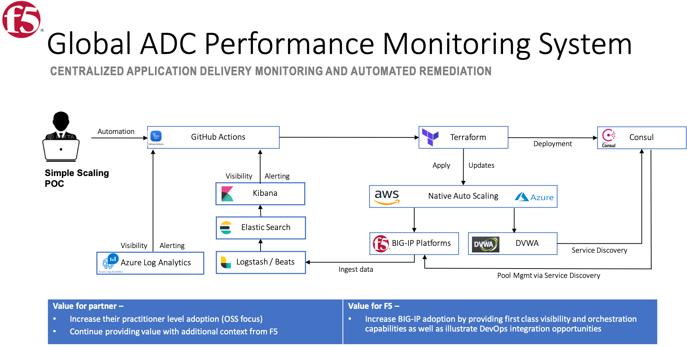

### The POC utilizes the following vendor products/services

#### F5 / Backend Application
  * BIG-IP VE – Application Delivery 
  * Telemetry Streaming, (TS) with custom endpoints
  * Application Services 3 Extension, (AS3)
  * NGINX OSS
  
#### GitHub 
  * Actions – Deployment/remediation automation workflow
  * Repository  - Code repository

#### HashiCorp
  * Terraform - App Deployment/Remediation
  * Consul - Backend workload service discovery 

#### Elastic.co
  * ELK Stack -  - Log Ingestion, Metrics aggr/indexing, Visualization, Alerting

#### Azure
 * ARM – Application stack hosting
 * LogForwarder Server, (Ubunu 18.04 vm)
 * Azure Log Anaytics - Log Ingestion, Metrics aggr/indexing, Visualization, Alerting

#### AWS
  * EC2 – Application stack hosting
  * Route53 – DNS 
