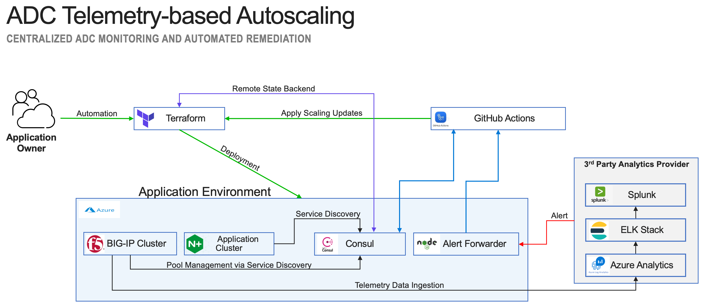

ADC Telemetry-based Autoscaling
===============================
This solution, (see below) illustrates how F5's Automation Toolchain can integrate with third party analytics provider(s) to provide cloud-agnostic centralized application delivery monitoring and autoscaling.  

The solution utilizes various third-party technologies/services along with F5’s automation toolchain including:
   
   - **Hashicorp Terraform** and **Consul** for infrastructure provisioning, service discovery and event logging
   - **F5 BIG-IP(s)** providing L4/L7 ADC Services
   - **F5 Declarative Onboarding**, (DO) and **Application Services 3 Extension**, (AS3) to deploy to configure BIG-IP application services
   - **F5 Telemetry Streaming**, (TS) to stream telemetry data to a third party analytics provider
   - **GitHub Actions** for workflow automation 
   - **Azure** public cloud for application hosting
   - **Third-party Analytics Provider**, (integrated with BIG-IP(s) via TS) for monitoring and alerting, (environment includes and ELK stack trial for testing/demo purposes)

### GitHub Secrets
Create the following [GitHub secrets](https://docs.github.com/en/actions/reference/encrypted-secrets).  The secrets will be utilized by the actions workflow to securely update the Azure deployment. You will need to provide [Azure service prinicipal credentials](https://github.com/marketplace/actions/azure-login) as well as a [GitHub acces token](https://docs.github.com/en/github/authenticating-to-github/keeping-your-account-and-data-secure/creating-a-personal-access-token) for your repository.

- GH_TOKEN   - *ex: ghp_mkqCzxBci0Sl3.......rY
- AZURE_CLIENT_ID   - *ex: XXXXXXXX-XXXX-XXXX-XXXX-XXXXXXXXXXXX
- AZURE_CLIENT_SECRET   - *ex: XXXXXXXXXXXXXXXXXXXXXXXXXXX
- AZURE_SUBSCRIPTION_ID   - *ex: XXXXXXXX-XXXX-XXXX-XXXX-XXXXXXXXXXXX
- AZURE_TENANT_ID   - *ex: XXXXXXXX-XXXX-XXXX-XXXX-XXXXXXXXXXXX
- AZURE_CREDS  - Comination of the above in JSON format  -  *ex: {"clientId": "XXXXXXXX-XXXX-XXXX-XXXX-XXXXXXXXXXXX",  "clientSecret": "XXXXXXXXXXXXXXXXXXXXXXXX", "subscriptionId": "XXXXXXXX-XXXX-XXXX-XXXX-XXXXXXXXXXXX", "tenantId": "XXXXXXXX-XXXX-XXXX-XXXX-XXXXXXXXXXXX"}*

### Terraform Variables
The following variables, (*located in ./terraform/terraform.tfvars*) should be modified as necessary.

- location = The Azure region where the application infrastructure will be deployed   -  *default: "eastus"*
- github_owner = Github Account hosting the repository   -  *ex: "f5devcentral"*
- repo_path =     -  *ex: "/repos/f5devcentral/adc-telemetry-based-autoscaling/dispatches"*
- github_token =   -  *ex: "ghp_mkqCzxBci0Sl3.......rY"
- bigip_count =    -  *default: 1* 
- workload_count =    -  *default: 2* 
- bigip_min =    -  *default: 1* 
- bigip_max =    -  *default: 5* 
- workload_min =    -  *default: 2*  
- workload_max =    -  *default: 5* 
- scale_interval =  Interval, (in seconds) between scaling events.  Alerts fired within interval setting will fail. -  *default: 300*  
- ts_consumer     = The analytics consumer connecting to (*1 = splunk   2 = elk   3 = azure log analytics -  default: 1*)
- splunkIP        = Optional - IP address of Splunk Enterprise.  TS declaration assumes HEC listening on default port of **8088** and using HTTPS
- splunkHEC       = Optional - Splunk HEC token
- logStashIP      = Optional - IP address of Logstash service.  TS declaration assumes logstash listening on default port of **8080** and using HTTP
- law_id          = Optional - Azure log analytics workspace ID
- law_primarykey  = Optional - Azure log analytics workspace primary key

### Deploying the Solution
1. Duplicate the repo - Since the solution relies on Github Actions for orchestration it will be necessary to first [duplcate the repo](https://docs.github.com/en/github/creating-cloning-and-archiving-repositories/creating-a-repository-on-github/duplicating-a-repository) into a Github account under your control.  Clone the newly created repo locally to perform the initial app infrastructure deployment.

1. Authenticate to Azure using [Azure CLI](https://registry.terraform.io/providers/hashicorp/azurerm/latest/docs/guides/azure_cli)

1. Navigate to the scripts directory, (*adc-telemetry-based-autoscaling/azure/scripts/*) and execute the deployment script - (*sh ./deploy.sh*).  The deployment script executes the Terraform project as illustrated above and migrates the local Terraform state to remote state located on the newly created Hashicorp Consul server.  The GitHub runners will reference the migrated state and repo-hosted terraform to perform infrastructure updates, (*scaling operations*).

## Configuring Alerts

### The AlertForwarder service
The alertforwarder service 

### Analytics Providers

The alertforwarder service currently supports alerts received from the following TS consumer: Splunk, Elastic Watcher/Kibana, and Azure Log Analytics.  A brief overview for each of the listed vendors is available below.  For detailed guidance on configuring sample alerts refer to the relevant consumer (*"vendor"*) folder located in the 'azure/ts_consumers' directory.

