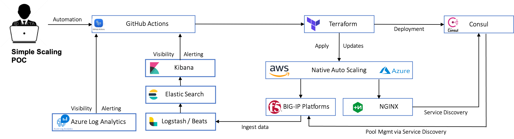
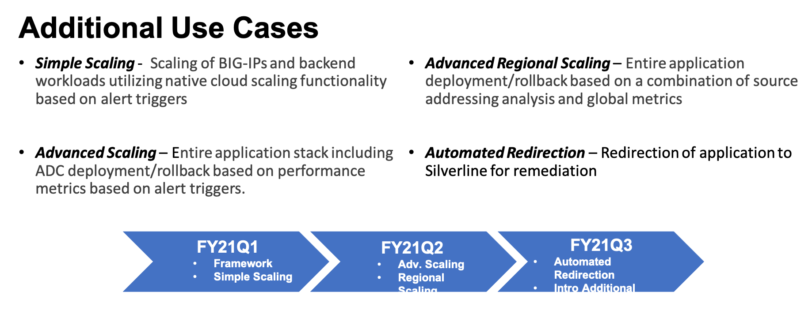

# ADC Performance Monitoring 
The ADC Performance Monitoring, (ADPM) repository deploys a demonstration environment illustrating [F5's Automation Toolchain](https://clouddocs.f5.com/) integrating with a third party analytics provider(s) to provide cloud-agnostic centralized application delivery monitoring and management.  The current POC illustrates simple scaling of delivery controllers, (F5 BIG-IP VE) as well as backend workloads.  The demonstration is designed to be connected to exsiting third-party analytics providers.  Examples for Azure Log Analytics and ELK stack integrations are included.

The POC utilizes the following vendor products/services:

#### F5 / Backend Application
  * BIG-IP VE – Application Delivery 
  * Telemetry Streaming, (TS) with custom endpoints
  * Application Services 3 Extension, (AS3)
  * F5 Terraform Provider
  * NGINX OSS
  
#### GitHub 
  * Actions – Deployment/remediation automation workflow
  * Repository  - Code repository

#### HashiCorp
  * Terraform - App Deployment/Remediation
  * Consul - Backend workload service discovery 

#### Elastic.co
  * ELK Stack - Log Ingestion, Metrics aggr/indexing, Visualization, Alerting

#### Azure
 * ARM – Application stack hosting w/native autoscaling
 * LogForwarder Server, (Ubunu 18.04 vm)
 * Azure Log Anaytics - Log Ingestion, Metrics aggr/indexing, Visualization, Alerting
 
#### AWS
  * EC2 – Application stack hosting w/native autoscaling
  * Route53 – DNS 
  The repository includes Terraform projects to deploy fully functioning application stacks. To deploy the Terraform projects, the following prerequsites and inputs are required:

## Prerequisites

## Inputs

 

