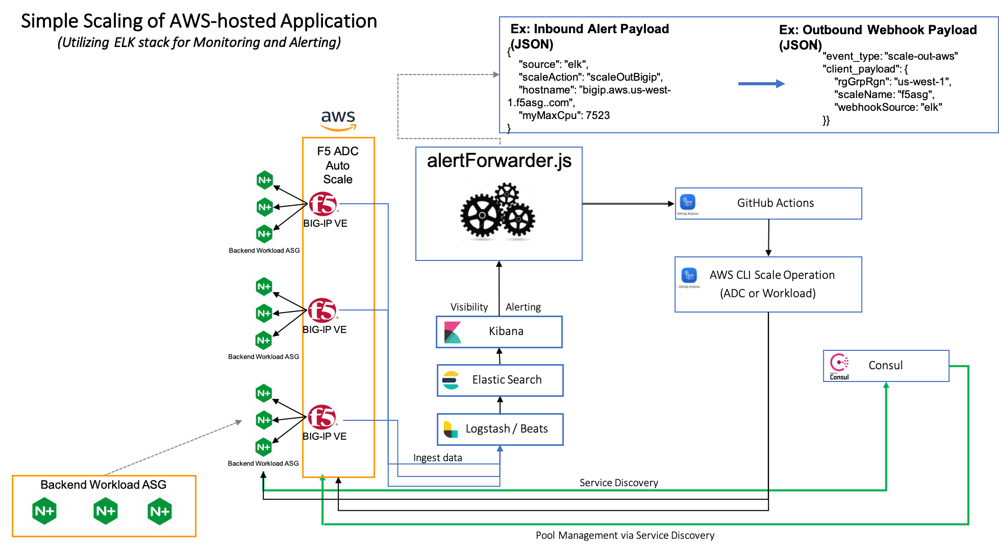

## Deployment Overview and Prerequisites
The 'aws' Terraform project deploys a single-tiered sample application onto the AWS platform.  The appication is designed to provde telemetry data to a preconfigured analytics provider.  Sample alert configurations and TS configuration examples are included for both Elastic's ELK stack and Azure Log Analytics.  Alert configuration steps, (with relevant screenshorts are available in the 'docs' folder.  The 

* F5 BIG-IP ADC (deployed into scale group), (default = 2, min = 1, max = 5)
* Backend Workload - (NGINX deployed into scale group), (default = 2, min = 1, max = 5)
* Consul server (VM)
* Alert Forwarding (VM)

### Variables 
* "prefix" {}                         -  Prefix to be appended to all Azure created resources
* "tls_cert" {default = ""}           -  base64 encoded certiificate
* "tls_pswd" {default = ""}           -  base64 encoded key
* "region"   {default = "us-west-1"}  _  AWS deployment region

#### Telemetry Variables
* wrkspace_id = <Azure Log Analytics workspace ID>
* passphrase = <Azure Log Analytics passphrase>

