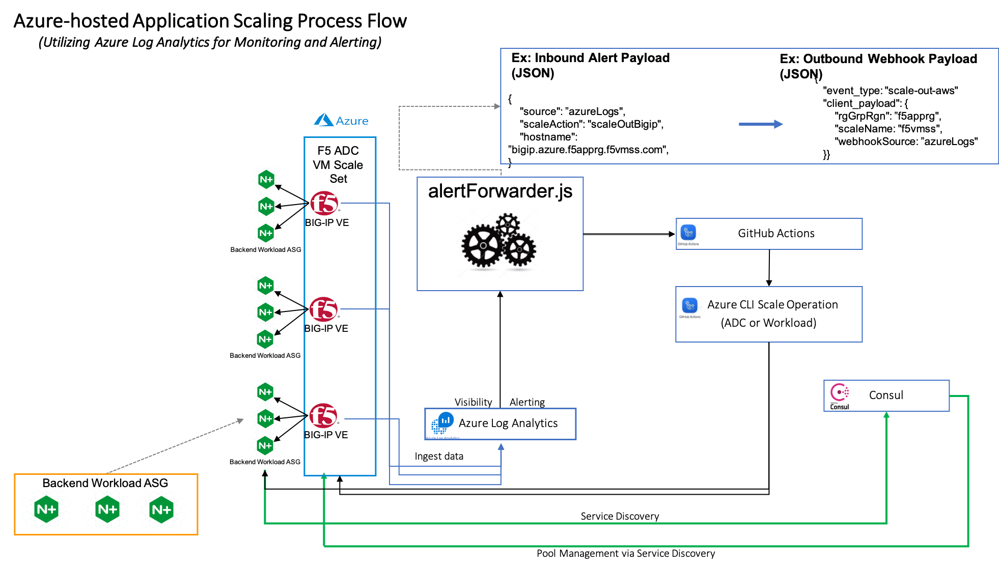

### Variables 
variable "sp_subscription_id" {default = ""}    -  Azure Subscription ID
variable "sp_client_id" {default = ""}          -  Azure Client/App ID
variable "sp_client_secret" {default = ""}      -  Azure Secret
variable "sp_tenant_id" {default = ""}          -  Azure Tenant ID
variable "prefix" {}                            -  Prefix to be appended to all Azure created resources
variable "uname" {default = "azureuser"}        -  Backend server username
variable "upassword" {default = "F5testnet!"}   -  Backend server password
variable "location" {default = "westus"}        -  Azure region

